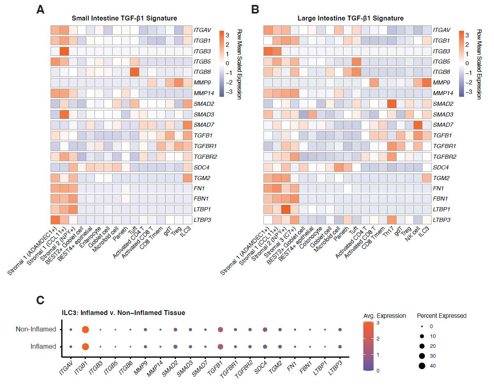

# ILC3s modulate immune-epithelial interactions in the gut via TGF-β1 activation

### Authors
- Diana Coman
- John W. Bassett
- Isabelle Coales
- Ainize Peña-Cearra
- Emily Read
- Zuzanna Łukasik
- Robin J. Dart
- Mark A. Travis
- Jenny Mjösberg
- Luke B. Roberts
- Joana F. Neves

### This repository contains the code for generating Figure 4 for the manuscript.

### Overview

This project is organized into two main directories: `HPC` and `R`. Below is a brief description of the contents of each directory.

#### HPC Directory

The `HPC` directory contains Jupyter Notebook files related to processing Gut Cell Atlas data on a high-performance computing (HPC) cluster.

- **Downsample_integrate_checkCounts.ipynb**: A notebook for downsampling and checking counts in the dataset, primarily used for visualization and quality assurance.
- **ImportData_and_subset-Small_intestine.ipynb**: A notebook for importing and subsetting raw data specific to the small intestine.
- **ImportData_and_subset-Large_intestine.ipynb**: A notebook for importing and subsetting raw data specific to the large intestine.
- **ImportData_and_subset_intestine-Norm.ipynb**: A notebook for importing normalized intestine data.

#### R Directory

The `R` directory contains R scripts organized into two subdirectories: `gca` and `pIBD`.

##### gca (Fig 4 A and B)

The `gca` subdirectory contains scripts for analyzing Gut Cell Atlas data, specifically for large and small intestine datasets:

- **large_intestine (Fig 4 B)**:
  - **00_LI_H5ad_to_Seurat.r**: Converts H5ad format data to Seurat objects for large intestine analysis.
  - **01_LI_QC_by_10xrun-cellType.r**: Quality control script for large intestine data, focusing on 10x run and cell type.
  - **02_LI_Downsample_cell_types.r**: Downsampling script for cell types in large intestine data.
  - **03_LI_Seurat_umap.r**: Generates UMAP visualizations for large intestine data using Seurat.
  - **AverageLogExpFig4.R**: Generates figures based on average log expression for large intestine data.

- **small_intestine (Fig 4 A)**:
  - **00_Small_int_H5ad_to_Seurat.r**: Converts H5ad format data to Seurat objects for small intestine analysis.
  - **01_SI_QC_by_10xrun-cellType.r**: Quality control script for small intestine data, focusing on 10x run and cell type.
  - **02_SI_Downsample_cell_types.r**: Downsampling script for cell types in small intestine data.
  - **03_SI_Seurat_umap.r**: Generates UMAP visualizations for small intestine data using Seurat.
  - **SI_genFig4a.R**: Generates figures for small intestine data.

##### pIBD (Fig 4 C)

The `pIBD` subdirectory contains scripts related to the integration and analysis of data for the pediatric inflammatory bowel disease dataset (pIBD):

- **00_integrate_cca.R**: Script for integrating datasets using canonical correlation analysis (CCA).
- **00integrate_comBat.R**: Script for batch effect correction using ComBat. (used for figure)
- **genFigure4e.R**: Generates specific figures related to the IBD analysis.
